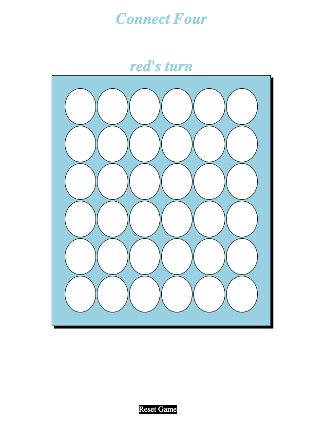

# Connect Four 
#### Connect Four is a two-player connection board game, in which the players choose a color and then take turns dropping colored discs into a six-column, six-row vertically suspended grid
#
### Game Board: 
 

## Feature:
#### This game features a two-layer vertical grid with colored discs for two players, plus blocking discs. The object of the game is also to get 4 in a row for a specific color of discs.
#
## The Language: 
##### HTML, CSS, Javascript. 
#
## Getting Started:
Link to game https://github.com/Futsum1/Connect-Four
## Next Step:
 * Planning to use 3D animation.
 * Add more features.
 #
 